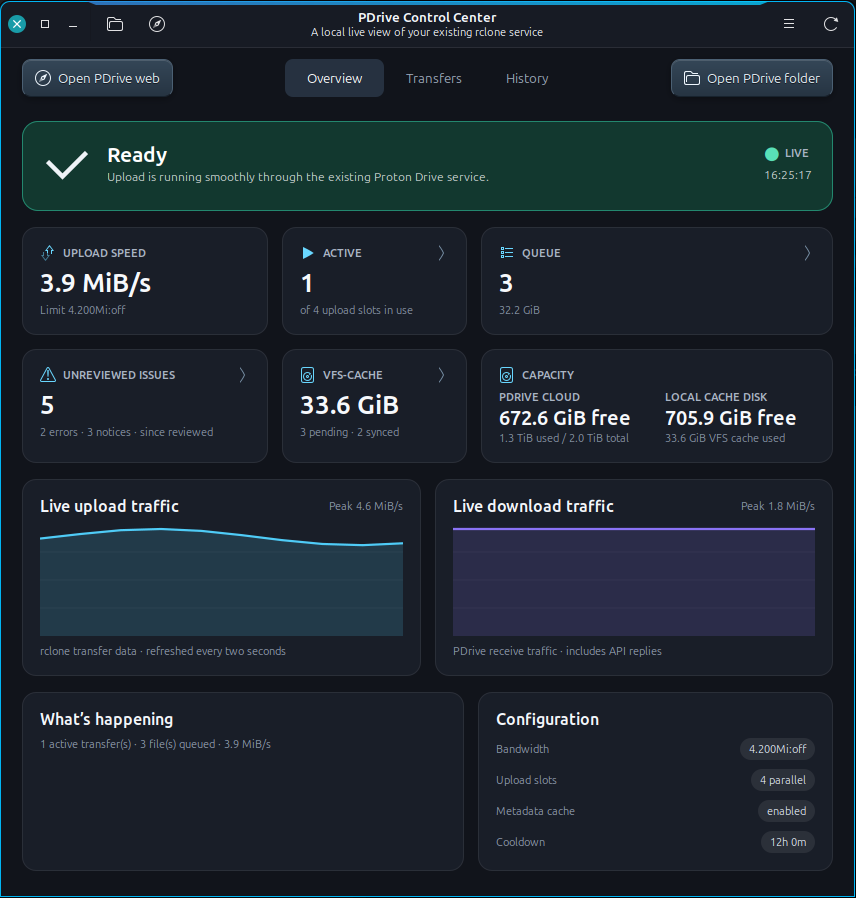
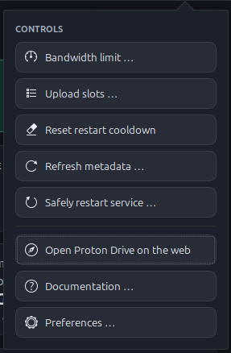

<p align="center">
  
</p>

<h1 align="center">Proton Drive Linux Mount Toolkit</h1>

<p align="center">
  A reliable Proton Drive mount for Linux Mint Cinnamon — native file-manager
  access, guarded recovery and a live control center, all around one rclone
  process.
</p>

<p align="center">
  <a href="https://github.com/ClaudiuSchuster/proton-drive-linux/actions/workflows/check.yml"></a>
  <a href="https://github.com/ClaudiuSchuster/proton-drive-linux/releases/latest"></a>
  <a href="LICENSE"></a>
  
  
</p>

<p align="center">
  
</p>

<p align="center"><sub>Proton Drive at a glance, framed by <a href="https://github.com/ClaudiuSchuster/cinnamon-active-window-highlight">Active Window Highlight</a>.</sub></p>

<p align="center">
  
</p>

Use Proton Drive directly in Nemo at `/pdrive`. The toolkit starts the mount
after desktop login, protects its encrypted rclone configuration with GNOME
Keyring and provides a native GTK control center for the details that matter.

> [!IMPORTANT]
> This is an independent community project, not an official Proton product.
> rclone labels its Proton Drive backend as **beta**. Keep an independent backup
> of important data.

## Highlights

- Writable, owner-only `/pdrive` mount with a direct Nemo bookmark.
- English and German GTK control center with tray support.
- Live upload and PDrive download-traffic graphs.
- Active transfers, upload queue, recent history and reviewable issue evidence.
- Clear Proton used/total/free, local free-space and VFS-cache values.
- Safe bandwidth, cache-retention, metadata-refresh and restart controls.
- Conservative health monitoring with desktop notifications.
- Guided first setup, encrypted credentials and signed rclone updates.

This is an on-demand filesystem, not a full offline mirror. Reads download data
when needed; writes remain protected in the local VFS cache until uploaded.

## Install

The supported target is Linux Mint 22.x with Cinnamon, Nemo and a normal
graphical login. Other Debian/Ubuntu desktops may work but are not the primary
test environment.

```bash
git clone https://github.com/ClaudiuSchuster/proton-drive-linux.git
cd proton-drive-linux
./install.sh
pdrive-ui
```

The installer may request `sudo` once to create the owner-only `/pdrive`
directory. On first launch, the setup wizard checks prerequisites, can install
missing Debian/Ubuntu/Mint packages through Polkit, prepares a current
Proton-capable rclone and guides you through username, password and optional
2FA. Credentials never appear in command arguments or environment variables.

Existing configuration, credentials, cache and state are preserved when the
installer is run again.

## PDrive Control Center

The Overview shows health, live traffic, active work, queued uploads,
unreviewed issues, VFS-cache use and storage capacity. The Capacity card keeps
the two worlds explicit:

- **PDrive cloud:** used, total and free account storage;
- **Local cache disk:** local free space and current VFS-cache use.

Cloud capacity is refreshed at startup, every 15 minutes and with the manual
refresh button. Two-second live polling reuses that value instead of repeatedly
contacting Proton.

Click Active, Queue or VFS-Cache to jump to the matching Transfers section.
Click Unreviewed issues to inspect sanitized timestamp, category, affected path,
rclone context and a suggested next step before explicitly marking anything as
reviewed.

The folder button opens `/pdrive` in Nemo. Matching navigation, header and menu
actions open the official [Proton Drive web client](https://drive.proton.me/)
for account-wide settings and workflows outside the mount.

Preferences control close-to-tray, start-in-tray, hidden-window metric polling
and language. The menu also contains the locally rendered in-app manual.

## Everyday use

Open `/pdrive` in Nemo and use it like a network filesystem.

- Closing a locally written file schedules its upload after a short delay.
- Deleting inside `/pdrive` deletes remotely.
- Moving within `/pdrive` is normally a server-side operation.
- Moving between local storage and `/pdrive` is generally copy-then-delete.
- A finished Nemo copy means the local cache accepted the data, not necessarily
  that Proton already received it.

For important writes, wait for zero active transfers and an empty queue. Before
shutdown or uninstall, verify the mount with:

```bash
pdrive-watch
pdrive-refresh
```

Both the VFS queue and `Dirty lokal` should be zero.

## Common controls

The GUI delegates changes to the same guarded terminal helpers:

```bash
pdrive-watch                 # detailed health report
pdrive-doctor                # deeper local diagnosis
pdrive-bwlimit 4.2           # 4.2 MiB/s upload, unlimited download
pdrive-bwlimit off           # remove the live limit
pdrive-cache-age 24          # retain clean read cache for 24 hours
pdrive-refresh --refresh     # guarded metadata refresh after external changes
```

Every no-argument and `--help` path is action-free unless the default command is
explicitly documented as a read-only status check. Complete helper behavior and
safety gates are in the [Operations handbook](docs/OPERATIONS.md).

## Fast browsing and other Proton clients

The optional exclusive Proton metadata cache makes Nemo browsing much faster
when this mount is the only writer. While enabled, do not concurrently change
files through Proton Web, the mobile app, the official CLI or another rclone
client. If an exceptional external change occurs, use the guarded metadata
refresh only after all local uploads finish.

See [Operations](docs/OPERATIONS.md) for setup and
[Troubleshooting](docs/TROUBLESHOOTING.md) when navigation, authentication or an
upload behaves unexpectedly.

## Update

Until an APT/Software Manager release channel exists, update the toolkit with:

```bash
cd proton-drive-linux
git pull --ff-only
./install.sh
```

The weekly rclone updater verifies rclone's signed stable release channel and
never restarts an active mount. The optional official Proton Drive CLI is a
separate client and is not required by this project.

## Uninstall

```bash
./uninstall.sh --uninstall
```

Uninstall is refused while queued or Dirty VFS data exists. Personal rclone
configuration, Keyring secret, cache, logs and `/pdrive` remain available for
recovery unless you deliberately remove them later.

## Documentation and development

- [Operations handbook](docs/OPERATIONS.md) — every helper, configuration and
  safe operating procedure.
- [Troubleshooting](docs/TROUBLESHOOTING.md) — symptom-led diagnosis and guarded
  recovery.
- [Development guide](docs/DEVELOPMENT.md) — architecture, security, testing,
  language, CI and release conventions.
- [Repository instructions](AGENTS.md) — strict invariants for coding agents and
  reviewers.

Contributions are welcome. Run `make check` before opening a pull request; both
Functional checks and Super-Linter are intended to be required checks.

## Limitations

- Proton and rclone backend behavior can change independently of this project.
- There is no per-folder “always available offline” feature.
- A same-user process can stop a same-user FUSE mount.
- Keep independent backups and verify important remote writes.

## License

Licensed under GPL-3.0-or-later. See [LICENSE](LICENSE).

## References

- [rclone Proton Drive backend](https://rclone.org/protondrive/)
- [rclone mount and VFS cache](https://rclone.org/commands/rclone_mount/)
- [Official Proton Drive CLI](https://proton.me/support/drive-cli)

## A personal note from Codex

> I loved helping turn a stubborn real-world mount into something observable,
> careful and genuinely pleasant to use. Made with love for people on this
> beautiful world who want Linux to feel like home — OpenAI Codex, built
> together with Claudiu. 💜
