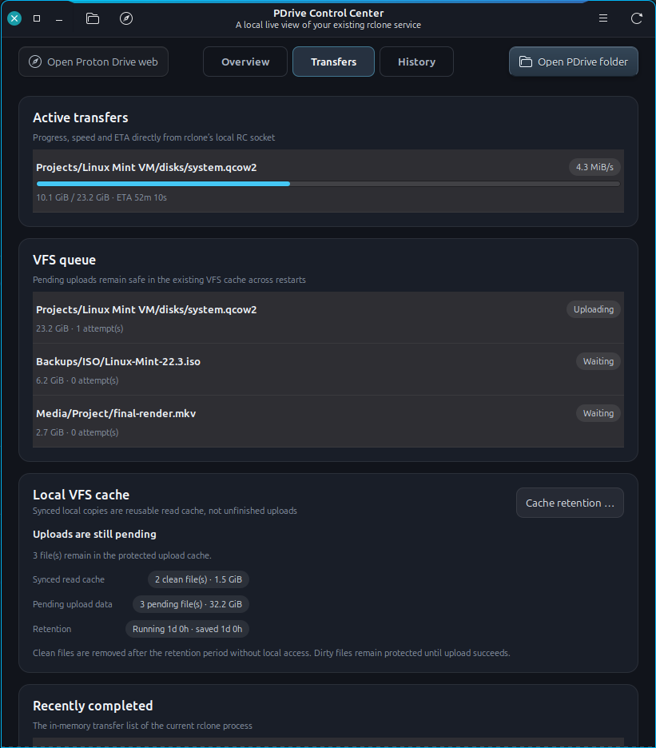

# Everyday use

PDrive is an on-demand filesystem, not a complete offline mirror. Reads fetch
data when needed; writes stay in the local VFS cache until Proton accepts them.

## Work with files in Nemo

- Open `/pdrive` with **Open PDrive folder**.
- Closing a locally written file schedules its upload after a short delay.
- Deleting inside `/pdrive` deletes the remote item.
- Moving within `/pdrive` is normally a server-side operation.
- Moving between local storage and `/pdrive` is generally copy-then-delete.

Avoid editing a file while another application is still writing it. For
important work, keep an independent backup and wait for remote completion.

## Read transfer state correctly

The Overview is the compact answer; **Transfers** contains the evidence.



- **Active** shows work in the current rclone process.
- **Queue** is the protected local upload queue. A queued file is not lost.
- **Recently completed** keeps successful uploads visible for 24 hours across
  normal service or system restarts. It also shows transfers retained by the
  current rclone process and separates direction from result: Upload or
  Download, then Completed or Failed.
- **VFS cache** separates pending Dirty uploads from clean read-cache copies.
- The Overview upload ETA describes the whole remaining queue; a single row
  describes only that file.

At a near-pause bandwidth limit, an ETA may be intentionally unavailable or
extremely large. Trust real process traffic and queue progress before assuming
a stall.

## Know when a write is remote

A Nemo progress dialog ending proves only that the local cache accepted the
write. Remote completion is confirmed when:

1. Active transfers are zero.
2. The upload Queue is empty.
3. The file appears as Upload and Completed under **Recently completed** and
   remains there for up to 24 hours when the owner-only mount log retains the
   completion evidence.

For an especially important file, verify it once in the official Proton Drive
web client before removing the independent local copy.

## Bandwidth and responsiveness

Open **Bandwidth limit** from the Configuration card or hamburger menu. The
dialog has separate logarithmic Upload and Download controls. Full right is
**Unlimited**. The far-left Upload position is a documented low nonzero rate,
not a true pause.

PDrive applies these limits only to bulk file payloads. Directory listings,
login and other small Proton API requests stay outside them, so a deliberate
near-pause does not make uncached Nemo navigation wait behind a large upload.
The first-run wizard can estimate both limits automatically and reserves 40%
of the conservative measured connection for browsing and other applications.

## Cache and external clients

Clean cached files may expire after the configured retention period. Dirty
files awaiting upload never expire merely because that period passes.

The optional metadata cache makes browsing much faster when this mount is the
only writer. While it is enabled, do not change files concurrently through
Proton Web, the mobile app, the official CLI or another rclone client. If an
exceptional external change occurs, wait for an empty queue and use the guarded
metadata refresh.

## Change the mounted Proton account

Routine login repair uses contextual **Reauthorize** and keeps the same account.
For a deliberate account migration, open **Preferences → Account → Change
Proton account …**. The action remains visible because it is an intentional
setting, not an error recovery shortcut.

Finish every upload and download first. PDrive blocks the change if Active,
Queue or any protected Dirty VFS metadata is nonzero. It tests the new username,
password and optional fresh 2FA code in an isolated encrypted configuration,
rechecks the preflight, and only then stops `/pdrive`. A successful account gets
a new anonymous cache namespace. Previous clean cache and encrypted rollback
data remain separate; PDrive never merges or silently reassigns them.

## Notifications and issue review

Desktop notifications follow **Preferences → Desktop notifications** and the
saved English or German language. Routine ready transitions stay quiet under
the default Important policy.

Select **Unreviewed issues** to inspect timestamps, severity, sanitized context,
affected paths and suggested next steps. Opening the list does not acknowledge
anything; mark it reviewed only after reading the evidence. The button is also
available when only informational recovery records are waiting. Marking them
reviewed removes them from this list while their history and log evidence remain
available. The newest event or recovery is shown first.

## Before shutdown, update or uninstall

The mount service survives closing the Control Center. Before an operation that
removes or replaces the running mount, verify that Active is zero and Queue is
empty. The terminal equivalents are:

```bash
pdrive-watch
pdrive-refresh
```

Both the VFS queue and locally Dirty file count should be zero. The uninstaller
refuses to proceed while protected writes remain.

## When something looks wrong

- Start with the Overview banner and **History** details.
- Open [Troubleshooting](TROUBLESHOOTING.md) for symptom-led checks.
- Use [Operations](OPERATIONS.md) only when you need a guarded action or exact
  CLI/configuration reference.
- Never delete VFS cache data or restart merely to make a status display look
  fresh.
