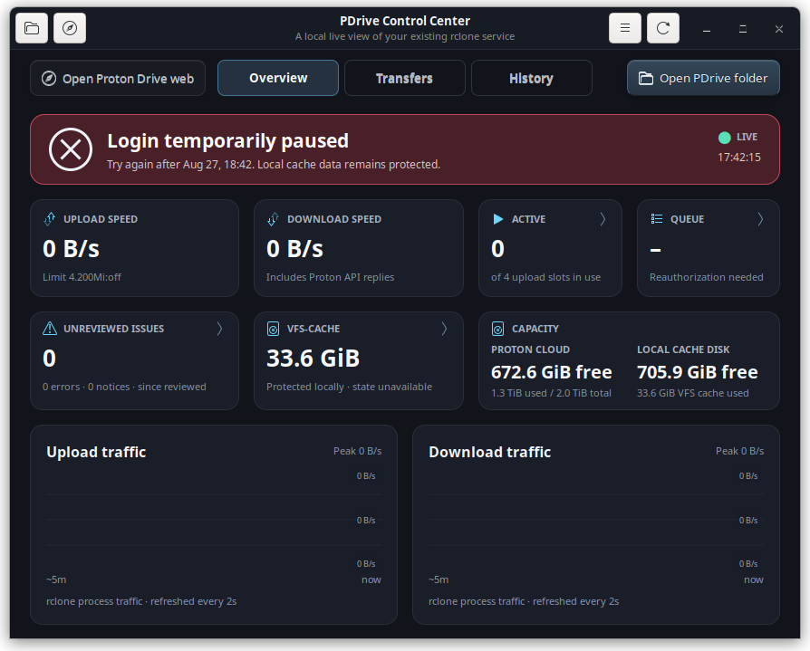

# Quick start

This page takes a new PDrive installation from zero to one verified remote
upload. Detailed maintenance belongs in [Operations](OPERATIONS.md), not here.

> [!IMPORTANT]
> PDrive is an independent community project, not an official Proton product.
> rclone labels its Proton Drive backend as beta. Keep an independent backup of
> important data.

## 1. Install

The supported target is Linux Mint 22.x with Cinnamon, Nemo and a graphical
login.

```bash
git clone https://github.com/oss-singularity/proton-drive-linux.git
cd proton-drive-linux
./install.sh
pdrive-ui
```

The installer may request administrator approval once to create the owner-only
`/pdrive` mountpoint. Personal rclone configuration, credentials, cache and
state are preserved when the installer is run again.

## 2. Complete the setup wizard

On first launch, PDrive Control Center guides you through these steps:

1. Check the required Mint, GTK, FUSE and Keyring components.
2. Install missing packages through the system Polkit prompt when needed.
3. Prepare the tested Proton-capable rclone build.
4. Enter your Proton username, password and optional fresh six-digit 2FA code.
5. Wait until the wizard confirms that `/pdrive` is mounted.

Credentials travel through private anonymous pipes. They never appear in
process arguments, environment variables or logs.

## 3. Open Proton Drive in Nemo

Select **Open PDrive folder** in the Control Center. Nemo opens `/pdrive`, the
single owner-only filesystem backed by your Proton Drive account. The separate
**Open Proton Drive web** action is for account settings and workflows that do
not belong to the mount.


## 4. Verify the first upload

1. Copy one small test file into `/pdrive` with Nemo.
2. Open **Transfers** and watch the file move through Active and Queue.
3. Wait until Active is zero, Queue is empty and the file appears under
   **Recently completed** with **Upload** and **Completed** badges.
4. For important data, also verify the file in the official Proton Drive web
   client.

A finished Nemo copy means the local VFS cache accepted the data. It does not
mean Proton has committed the remote file yet. Dirty upload data stays protected
in the local cache across ordinary service recovery.

## 5. Know the protected login state

When Proton requires a fresh login, PDrive stops automatic retries before they
can repeatedly hit the account. The Overview shows the protected state and the
Control Center offers one guided reauthorization.



If Proton rate-limits login attempts, wait until the displayed retry time. Do
not bypass the cooldown with manual service starts. The encrypted configuration
and local upload cache remain untouched while login is paused.

## Where to go next

- [Everyday use](EVERYDAY_USE.md) explains Nemo, transfers, cache and routine
  notifications.
- [Troubleshooting](TROUBLESHOOTING.md) starts from a visible symptom.
- [Operations](OPERATIONS.md) contains every setting, guarded action and helper.
- [Online project documentation](https://github.com/oss-singularity/proton-drive-linux#documentation-and-development)
  remains available when you want the complete repository view.
